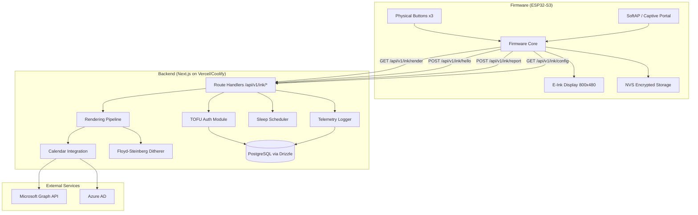
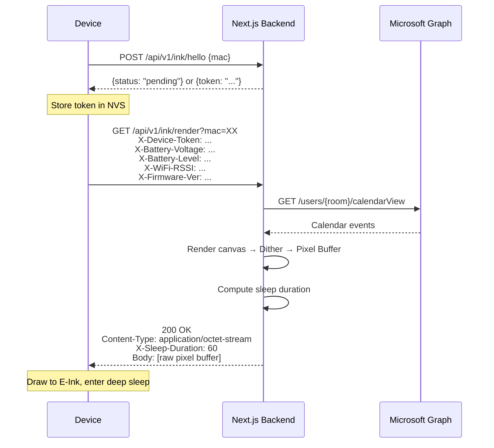

# Design Document: Vellum Display System

## Overview

Vellum is a headless, server-side rendered E-Ink display system for meeting room status indicators. The architecture follows a thin-client model: ESP32-S3 devices handle only network communication, button input, and raw pixel display, while a Next.js backend owns all business logic — calendar integration, canvas rendering, Floyd-Steinberg dithering, authentication, and adaptive power scheduling.

The system comprises two independently developed and deployed units:

1. **Backend** — A Next.js 16.1 application (App Router, Route Handlers) deployed on Vercel or Coolify, exposing REST API endpoints for device rendering, authentication, telemetry, and configuration. Uses Drizzle ORM with PostgreSQL (Neon/Supabase) for persistence.
2. **Firmware** — ESP32-S3 firmware (C/Arduino) managing Wi-Fi provisioning, TOFU authentication, deep sleep, button handling, and E-Ink display. Developed and flashed independently of the backend.

## Architecture



### Request Flow



---

# Part 1: Backend Design

## Technology Stack

| Concern | Choice | Rationale |
|---------|--------|-----------|
| Framework | Next.js 16.1.6 (App Router) | Route Handlers for API, easy Vercel/Coolify deploy, edge-compatible |
| Runtime | Node.js 22+ | LTS, native fetch, stable canvas support |
| ORM | Drizzle ORM 0.45.1 | Type-safe, lightweight, serverless-friendly, no heavy connection pooling |
| Database | PostgreSQL (Neon or Supabase) via `pg` 8.18.0 | Serverless Postgres, connection pooling built-in, Vercel integration |
| Canvas | `@napi-rs/canvas` 0.1.92 | Faster than `node-canvas`, pure Rust bindings, no system deps on Vercel |
| Validation | Zod 4.3.6 | Runtime schema validation, TypeScript-first, pairs with Drizzle |
| Auth tokens | `crypto.randomBytes` | Node.js built-in, no external dependency |
| Calendar | Microsoft Graph SDK (`@microsoft/microsoft-graph-client` 3.0.7) | Official SDK for Graph API |
| Azure Auth | `@azure/identity` 4.13.0 (`ClientSecretCredential`) | Official Azure SDK for client credentials flow |
| Timezone | `date-fns` 4.1.0 + `@date-fns/tz` 1.4.1 | First-class timezone support in date-fns v4, tree-shakeable |
| Testing | Vitest 4.0.18 + fast-check 4.5.3 | Fast, ESM-native, property-based testing support |
| Migrations | drizzle-kit 0.31.9 | CLI migrator tool for Drizzle ORM |

## Backend Components and Interfaces

### 1. API Route Handlers (`app/api/v1/ink/`)

Next.js Route Handlers expose four endpoints. All JSON responses use a consistent envelope. The render endpoint returns binary data.

**Endpoints:**

| Method | Path | Auth | Request | Response |
|--------|------|------|---------|----------|
| POST | `/api/v1/ink/hello` | None | `{ mac: string }` | `{ status, data: { token? } }` |
| GET | `/api/v1/ink/render` | X-Device-Token | `?mac=string` | Binary Pixel_Buffer + `X-Sleep-Duration` header |
| POST | `/api/v1/ink/report` | X-Device-Token | `{ mac: string, issue: string }` | `{ status, data: {} }` |
| GET | `/api/v1/ink/config` | X-Device-Token | `?mac=string` | `{ status, data: { otaUrl?, rotation? } }` |

**Middleware (implemented as utility functions called in Route Handlers):**
- `validateDeviceToken(request)` — Validates `X-Device-Token` header against device registry. Returns 401 for invalid/missing tokens.
- `extractTelemetry(request)` — Extracts `X-Battery-Voltage`, `X-Battery-Level`, `X-WiFi-RSSI`, `X-Firmware-Ver` headers and logs them.
- `validateRequest(schema, data)` — Zod-based validation, returns 400 with descriptive JSON error body on failure.

**Response Envelope:**
```typescript
interface ApiResponse<T> {
  status: "ok" | "error";
  data: T | null;
  error: string | null;
}

function okResponse<T>(data: T): ApiResponse<T> {
  return { status: "ok", data, error: null };
}

function errorResponse(message: string): ApiResponse<null> {
  return { status: "error", data: null, error: message };
}
```

### 2. TOFU Authentication Module (`lib/auth/`)

Manages device lifecycle: unknown → pending → approved → authenticated.

```typescript
interface DeviceRecord {
  mac: string;
  status: "pending" | "approved" | "rejected";
  token: string | null;
  approvedAt: Date | null;
  lastSeen: Date | null;
}
```

**Key Functions:**
- `handleHello(mac: string): Promise<HelloResponse>` — Registers unknown devices as pending, returns token for approved devices.
- `approveDevice(mac: string): Promise<void>` — Admin action: generates crypto token, transitions device to approved.
- `validateToken(mac: string, token: string): Promise<boolean>` — Checks token validity for authenticated requests.

Token generation uses `crypto.randomBytes(32).toString('hex')`.

### 3. Calendar Integration Module (`lib/calendar/`)

Handles Microsoft Graph API communication using Azure AD Client Credentials Flow.

```typescript
interface CalendarEvent {
  subject: string;
  organizer: string;
  startTime: Date;  // UTC
  endTime: Date;    // UTC
  isPrivate: boolean;
}

interface RoomCalendarData {
  roomEmail: string;
  timezone: string;
  events: CalendarEvent[];
  fetchedAt: Date;
}
```

**Key Functions:**
- `getGraphClient(): Client` — Creates authenticated Graph client via `ClientSecretCredential`.
- `fetchRoomEvents(roomEmail: string, windowHours: number): Promise<CalendarEvent[]>` — Fetches calendar view from Graph API.
- `applyRoomPolicy(events: CalendarEvent[], policy: RoomPolicy): DisplayEvent[]` — Transforms events based on privacy policy.

**Timezone Conversion (date-fns v4 + @date-fns/tz):**
```typescript
import { TZDate } from "@date-fns/tz";

// Convert UTC date to room timezone
function toRoomTime(utcDate: Date, timezone: string): TZDate {
  return new TZDate(utcDate, timezone);
}
```

**Room Policy Application:**

| Policy | Public Event | Private Event |
|--------|-------------|---------------|
| `"Show All"` | Subject + Organizer + Time | "Booked by [Organizer]" 🔒 + Time |
| `"Hide Subject"` | "Reserved" + Time | "Reserved" + Time |
| `"Hide All"` | "FREE" / "BUSY" only | "FREE" / "BUSY" only |

### 4. Rendering Pipeline (`lib/render/`)

Converts calendar data into an 800x480 raw pixel buffer using `@napi-rs/canvas`.

**Layout Structure:**
```
┌──────────────────────────────────┐
│  Room Name              Status   │  ← Header: room name + FREE/BUSY
│──────────────────────────────────│
│  ┌────────────────────────────┐  │
│  │ Current / Next Meeting     │  │  ← Primary slot
│  │ 10:00 - 11:00  Subject     │  │
│  └────────────────────────────┘  │
│  ┌────────────────────────────┐  │
│  │ Upcoming Slot 2            │  │  ← Secondary slots (2-3)
│  └────────────────────────────┘  │
│  ┌────────────────────────────┐  │
│  │ Upcoming Slot 3            │  │
│  └────────────────────────────┘  │
│  Last Updated: 10:32 AM         │  ← Footer
└──────────────────────────────────┘
```

**Key Functions:**
- `renderLayout(roomName: string, events: DisplayEvent[], timezone: string, now: Date): Canvas` — Draws the meeting room layout onto an 800x480 canvas.
- `canvasToPixelBuffer(canvas: Canvas, palette: ColorPalette): Buffer` — Extracts pixel data and applies Floyd-Steinberg dithering.
- `renderOfflineLayout(roomName: string, now: Date): Canvas` — Renders the "System Offline" fail-safe layout.

### 5. Floyd-Steinberg Ditherer (`lib/render/dither.ts`)

Converts 24-bit RGB canvas output to the limited E-Ink color palette (typically black, white, red or black, white, yellow depending on panel).

```typescript
type ColorPalette = [number, number, number][]; // Array of RGB triples

function floydSteinbergDither(
  imageData: Uint8ClampedArray,
  width: number,
  height: number,
  palette: ColorPalette
): Buffer;
```

The algorithm processes pixels left-to-right, top-to-bottom, distributing quantization error to neighboring pixels with the standard weights: 7/16 right, 3/16 below-left, 5/16 below, 1/16 below-right.

**Dithering Properties:**
- Output buffer contains only palette color indices.
- Output dimensions match input dimensions exactly.
- The algorithm is deterministic: same input always produces same output.

### 6. Sleep Scheduler (`lib/sleep/`)

Computes the `X-Sleep-Duration` value based on device power state and upcoming calendar events.

```typescript
interface SleepContext {
  powerSource: "usb" | "battery";
  batteryLevel: number;       // 0-100
  nextEventStart: Date | null;
  now: Date;
}

function computeSleepDuration(ctx: SleepContext): number; // seconds
```

**Decision Logic (priority order):**
1. USB powered → 60 seconds
2. Battery < 20% → 3600 seconds
3. Battery powered, meeting within 20 minutes → `(nextEventStart - now - 5min)` in seconds
4. Battery powered, no imminent meeting → 900 seconds

**Jitter Application:**
```typescript
function applyJitter(baseDuration: number, maxJitter: number = 10): number;
```
Adds a random offset in `[0, maxJitter]` seconds to the base duration.

### 7. Telemetry Logger (`lib/telemetry/`)

Records device health metrics from HTTP headers into the database.

```typescript
interface TelemetryEntry {
  mac: string;
  batteryVoltage: number;
  batteryLevel: number;
  wifiRssi: number;
  firmwareVersion: string;
  timestamp: Date;
}

function logTelemetry(entry: TelemetryEntry): Promise<void>;
```

## Backend Data Models

### Database Schema (Drizzle ORM + PostgreSQL)

```typescript
// db/schema.ts
import { pgTable, text, integer, real, timestamp, serial, pgEnum } from "drizzle-orm/pg-core";

export const deviceStatusEnum = pgEnum("device_status", ["pending", "approved", "rejected"]);
export const roomPolicyEnum = pgEnum("room_policy", ["Show All", "Hide Subject", "Hide All"]);

export const devices = pgTable("devices", {
  mac: text("mac").primaryKey(),
  status: deviceStatusEnum("status").notNull().default("pending"),
  token: text("token"),
  roomEmail: text("room_email"),
  roomName: text("room_name"),
  roomTimezone: text("room_timezone").default("UTC"),
  roomPolicy: roomPolicyEnum("room_policy").default("Show All"),
  approvedAt: timestamp("approved_at"),
  lastSeen: timestamp("last_seen"),
  createdAt: timestamp("created_at").defaultNow().notNull(),
});

export const telemetry = pgTable("telemetry", {
  id: serial("id").primaryKey(),
  mac: text("mac").notNull().references(() => devices.mac),
  batteryVoltage: real("battery_voltage"),
  batteryLevel: integer("battery_level"),
  wifiRssi: integer("wifi_rssi"),
  firmwareVersion: text("firmware_version"),
  timestamp: timestamp("timestamp").defaultNow().notNull(),
});

export const reports = pgTable("reports", {
  id: serial("id").primaryKey(),
  mac: text("mac").notNull().references(() => devices.mac),
  issue: text("issue"),
  timestamp: timestamp("timestamp").defaultNow().notNull(),
});
```

### Zod Validation Schemas

```typescript
// lib/validation.ts
import { z } from "zod";

export const macSchema = z.string().regex(/^([0-9A-Fa-f]{2}:){5}[0-9A-Fa-f]{2}$/);

export const helloRequestSchema = z.object({
  mac: macSchema,
});

export const reportRequestSchema = z.object({
  mac: macSchema,
  issue: z.string().min(1),
});

export const renderQuerySchema = z.object({
  mac: macSchema,
});
```

### TypeScript Domain Types

```typescript
// lib/types.ts
type RoomPolicy = "Show All" | "Hide Subject" | "Hide All";
type DeviceStatus = "pending" | "approved" | "rejected";

interface DisplayEvent {
  displaySubject: string;
  organizer: string;
  startTime: Date;
  endTime: Date;
  isPrivate: boolean;
  showLockIcon: boolean;
}

interface RenderContext {
  device: DeviceRecord;
  events: DisplayEvent[];
  roomName: string;
  timezone: string;
  now: Date;
  staleCutoff: Date; // now - 4 hours
}
```

---

# Part 2: Firmware Design

## Firmware Technology Stack

| Concern | Choice | Rationale |
|---------|--------|-----------|
| Platform | ESP32-S3 (Seeed reTerminal E10xx) | Target hardware |
| Framework | Arduino / ESP-IDF | Mature ecosystem, SoftAP + NVS support |
| HTTP Client | ESP-IDF HTTP client | Built-in, TLS support |
| Display Driver | GxEPD2 or vendor-specific | E-Ink driver for 800x480 panel |
| Storage | ESP-IDF NVS (encrypted) | Built-in encrypted key-value store |

## Firmware Modules

### 1. WiFi Manager (`firmware/src/wifi_manager/`)

Handles two modes of operation:

**Station Mode (normal):**
- Reads SSID/password from NVS
- Connects to configured Wi-Fi network
- 30-second connection timeout
- On failure: re-enters SoftAP mode after 3 retries

**SoftAP Mode (provisioning):**
- Broadcasts configuration network (SSID: `Vellum-XXXX` where XXXX = last 4 of MAC)
- Renders QR code with Wi-Fi connection string to E-Ink display
- Serves captive portal on 192.168.4.1
- Captive portal: minimal HTML form for SSID + password entry
- On valid submission: stores credentials in encrypted NVS, restarts in station mode
- On invalid submission: shows error, allows retry

### 2. NVS Manager (`firmware/src/nvs_manager/`)

Encrypted key-value storage for persistent device configuration.

| Key | Type | Description |
|-----|------|-------------|
| `wifi_ssid` | string (max 32) | Wi-Fi network SSID |
| `wifi_pass` | string (max 64) | Wi-Fi password |
| `device_token` | string (64 hex) | TOFU authentication token |
| `server_url` | string | Backend server base URL |

### 3. HTTP Client (`firmware/src/http_client/`)

Communicates with the Next.js backend. Every request includes telemetry headers.

**Request Headers (all requests):**
- `X-Battery-Voltage`: float (e.g., "3.72")
- `X-Battery-Level`: integer 0-100
- `X-WiFi-RSSI`: integer dBm (e.g., "-65")
- `X-Firmware-Ver`: semver string (e.g., "1.0.0")
- `X-Device-Token`: 64-char hex string (on authenticated requests)

**Endpoints called:**
- `POST /api/v1/ink/hello` — First-time registration
- `GET /api/v1/ink/render?mac=XX` — Fetch pixel buffer
- `POST /api/v1/ink/report` — Report room issue
- `GET /api/v1/ink/config` — Fetch device config

### 4. E-Ink Driver (`firmware/src/display/`)

Manages the 800x480 E-Ink panel.

**Operations:**
- `drawPixelBuffer(buffer, length)` — Writes raw pixel buffer directly to display RAM
- `drawFallbackIcon(iconId)` — Draws a hardcoded bitmap from flash
- `drawQRCode(data)` — Renders QR code for SoftAP provisioning
- `showLoadingIndicator()` — Brief loading animation during server requests

**Fallback Icons (stored in flash as C arrays):**

| Icon ID | Name | Trigger |
|---------|------|---------|
| 0 | "No Signal" | Wi-Fi connection failure |
| 1 | "Cloud Disconnect" | Server HTTP 5xx error |
| 2 | "Unauthorized" | HTTP 401 response |
| 3 | "Connect Power" | Battery < 5% |
| 4 | "Error" | Malformed pixel buffer (small overlay) |

### 5. Button Handler (`firmware/src/buttons/`)

Interrupt-driven with software debounce (50ms).

| Button | Action | Behavior |
|--------|--------|----------|
| Button 1 (top) | Short press | Wake from sleep, request fresh render |
| Button 2 (middle) | Short press | Send issue report via POST /api/v1/ink/report |
| Button 3 (bottom) | Hold 5 seconds | Enter SoftAP mode for reconfiguration |

All button-triggered server requests show a loading indicator on the E-Ink screen.

### 6. Sleep Manager (`firmware/src/sleep/`)

Configures ESP32-S3 deep sleep with GPIO wake sources (buttons).

**Flow:**
1. Receive `X-Sleep-Duration` from server response header
2. Configure deep sleep timer for specified duration
3. Configure GPIO wake sources for button interrupts
4. Enter deep sleep
5. On wake: determine wake reason (timer vs button), act accordingly

### 7. Firmware Main Loop (`firmware/src/main.cpp`)

```
boot()
  ├─ Check NVS for Wi-Fi credentials
  │   ├─ No credentials → Enter SoftAP mode
  │   └─ Has credentials → Connect to Wi-Fi
  │       ├─ Connection failed → Show "No Signal", retry/SoftAP
  │       └─ Connected
  │           ├─ Check NVS for device token
  │           │   ├─ No token → POST /hello, store token if approved
  │           │   └─ Has token → GET /render
  │           │       ├─ 200 → Draw pixel buffer, read X-Sleep-Duration, sleep
  │           │       ├─ 401 → Show "Unauthorized" icon, retry hello
  │           │       ├─ 5xx → Show "Cloud Disconnect" icon, sleep
  │           │       └─ Malformed → Keep previous image, show error overlay
  │           └─ Check battery
  │               └─ < 5% → Show "Connect Power", permanent sleep
  └─ Enter deep sleep
```

---

## Correctness Properties

*A property is a characteristic or behavior that should hold true across all valid executions of a system — essentially, a formal statement about what the system should do. Properties serve as the bridge between human-readable specifications and machine-verifiable correctness guarantees.*

### Property 1: Room policy transforms public and private events correctly under "Show All"

*For any* calendar event and "Show All" room policy: if the event is public, the display subject should equal the original subject with the organizer and time range preserved; if the event is private, the display subject should equal "Booked by [Organizer Name]" with `showLockIcon` set to true.

**Validates: Requirements 4.3, 4.4**

### Property 2: "Hide Subject" policy replaces all subjects with "Reserved"

*For any* calendar event (public or private) and "Hide Subject" room policy, the display subject should equal "Reserved" and the time range should still be present.

**Validates: Requirements 4.5**

### Property 3: "Hide All" policy produces only FREE/BUSY status

*For any* set of calendar events and "Hide All" room policy, the output should contain only a "FREE" or "BUSY" indicator with no event subjects, organizer names, or time ranges exposed.

**Validates: Requirements 4.6**

### Property 4: Timezone conversion round-trip

*For any* UTC datetime and any valid IANA timezone string, converting the datetime to the room timezone and then back to UTC should produce the original UTC datetime.

**Validates: Requirements 4.7**

### Property 5: Sleep duration computation follows priority rules

*For any* valid `SleepContext`: (a) if `powerSource` is "usb", the result is 60; (b) if `powerSource` is "battery" and `batteryLevel` < 20, the result is 3600; (c) if `powerSource` is "battery", `batteryLevel` >= 20, and `nextEventStart` is within 20 minutes of `now`, the result equals `(nextEventStart - now - 5 minutes)` in seconds; (d) otherwise the result is 900.

**Validates: Requirements 6.2, 6.3, 6.4, 6.5**

### Property 6: Jitter stays within bounds

*For any* base sleep duration and max jitter of 10 seconds, `applyJitter(baseDuration, 10)` should return a value in the range `[baseDuration, baseDuration + 10]`.

**Validates: Requirements 6.7, 11.3**

### Property 7: Dithered output contains only palette indices and preserves dimensions

*For any* input image data (width × height × RGBA) and any color palette, the Floyd-Steinberg dithered output buffer should have exactly `width × height` entries, and every entry should be a valid index into the provided palette.

**Validates: Requirements 5.6**

### Property 8: Render layout contains required visual elements

*For any* valid render context (room name, display events, timezone, current time) where calendar data is not stale, the rendered layout should contain: (a) a "FREE" or "BUSY" status indicator, (b) up to 3 upcoming event slots matching the input events, and (c) a "Last Updated" timestamp. The output pixel buffer should have dimensions exactly 800 × 480.

**Validates: Requirements 5.1, 5.2, 5.3, 5.4**

### Property 9: Stale calendar data triggers fail-safe

*For any* render context where the calendar data `fetchedAt` timestamp is more than 4 hours before `now`, the rendered layout should display a "System Offline" message instead of normal calendar content.

**Validates: Requirements 5.5**

### Property 10: Unknown MAC registration creates pending device

*For any* valid MAC address string not already in the device registry, calling `handleHello(mac)` should create a device record with status "pending" and return a response indicating pending status.

**Validates: Requirements 3.2**

### Property 11: Approved device receives token on next hello

*For any* device in "pending" status, after calling `approveDevice(mac)`, the next call to `handleHello(mac)` should return a non-empty cryptographic token, and the device record should have status "approved" with a non-null token.

**Validates: Requirements 3.3**

### Property 12: Invalid or missing token returns 401

*For any* render request where the X-Device-Token header is missing, empty, or does not match any approved device's token, the server should respond with HTTP 401.

**Validates: Requirements 3.6**

### Property 13: Telemetry headers are logged with correct MAC association

*For any* request containing telemetry headers (X-Battery-Voltage, X-Battery-Level, X-WiFi-RSSI, X-Firmware-Ver) from a device with a known MAC, the server should create a telemetry entry with matching MAC and header values.

**Validates: Requirements 7.2**

### Property 14: Missing required parameters return HTTP 400

*For any* API endpoint and any request missing one or more required parameters, the server should respond with HTTP 400 and a JSON body containing a descriptive error message in the envelope format.

**Validates: Requirements 10.5**

### Property 15: All JSON responses use consistent envelope format

*For any* JSON API response from the server, the response body should parse to an object containing exactly the fields `status`, `data`, and `error`, where `status` is either "ok" or "error".

**Validates: Requirements 10.6**

### Property 16: API response serialization round-trip

*For any* valid `ApiResponse` object, serializing it to JSON and deserializing the JSON back should produce an object deeply equal to the original.

**Validates: Requirements 10.7**

### Property 17: Render response always includes sleep duration header

*For any* successful render response, the X-Sleep-Duration header should be present and contain a positive integer value.

**Validates: Requirements 6.1**

## Error Handling

### Backend Errors

| Error Condition | HTTP Status | Response | Notes |
|----------------|-------------|----------|-------|
| Missing required parameter | 400 | `{ status: "error", data: null, error: "Missing parameter: {name}" }` | All endpoints |
| Invalid/missing device token | 401 | `{ status: "error", data: null, error: "Unauthorized" }` | Render, report, config endpoints |
| Unknown MAC on render | 404 | `{ status: "error", data: null, error: "Device not found" }` | Device must call /hello first |
| Device pending approval | 403 | `{ status: "error", data: null, error: "Device pending approval" }` | Render before admin approval |
| Microsoft Graph API failure | 502 | `{ status: "error", data: null, error: "Calendar service unavailable" }` | Upstream dependency failure |
| Internal rendering failure | 500 | `{ status: "error", data: null, error: "Render failed" }` | Canvas/dithering errors |

**Backend Error Strategy:**
- All errors return the standard `ApiResponse` envelope format.
- Microsoft Graph API failures are retried once with exponential backoff before returning 502.
- If calendar data fetch fails but cached data exists and is less than 4 hours old, the server uses cached data.
- If cached data is stale (>4 hours), the server renders the "System Offline" fail-safe layout.

### Firmware Error Handling

| Error Condition | Device Behavior |
|----------------|-----------------|
| Wi-Fi connection failure | Display "No Signal" icon, retry after 30 seconds, re-enter SoftAP after 3 failures |
| HTTP 401 from server | Display "Unauthorized" fallback icon, retry hello flow |
| HTTP 5xx from server | Display "Cloud Disconnect" icon, sleep for normal duration and retry |
| Battery < 5% | Display "Connect Power" icon, enter permanent deep sleep |
| Malformed pixel buffer | Keep previous display, show small error indicator overlay |
| HTTP timeout (30s) | Treat as 5xx, display "Cloud Disconnect" icon |

## Testing Strategy

### Testing Framework

- **Backend**: Vitest for unit and property tests, Next.js test utilities for Route Handler integration tests.
- **Property-Based Testing**: `fast-check` library for TypeScript property-based tests.
- **Firmware**: Unity test framework for C unit tests (where applicable, host-side testing).

### Dual Testing Approach

**Unit Tests** — Verify specific examples, edge cases, and error conditions:
- Specific calendar event transformations with known inputs/outputs
- API endpoint responses for specific request shapes
- Error handling paths (401, 400, 5xx responses)
- Edge cases: empty event lists, midnight-crossing events, DST transitions

**Property-Based Tests** — Verify universal properties across generated inputs:
- Each correctness property (1-17) maps to a dedicated `fast-check` property test
- Minimum 100 iterations per property test
- Each test tagged with: `Feature: vellum-display-system, Property {N}: {title}`
- Generators for: MAC addresses, calendar events, room policies, sleep contexts, API responses

### Key Test Generators (fast-check)

```typescript
// MAC address generator
const arbMac = fc.hexaString({ minLength: 12, maxLength: 12 })
  .map(s => s.match(/.{2}/g)!.join(':'));

// Calendar event generator
const arbCalendarEvent = fc.record({
  subject: fc.string({ minLength: 1 }),
  organizer: fc.string({ minLength: 1 }),
  startTime: fc.date(),
  endTime: fc.date(),
  isPrivate: fc.boolean(),
});

// Room policy generator
const arbRoomPolicy = fc.constantFrom("Show All", "Hide Subject", "Hide All");

// Sleep context generator
const arbSleepContext = fc.record({
  powerSource: fc.constantFrom("usb", "battery"),
  batteryLevel: fc.integer({ min: 0, max: 100 }),
  nextEventStart: fc.option(fc.date()),
  now: fc.date(),
});

```

### Test Organization

```
app/                          # Next.js App Router
  api/v1/ink/
    hello/route.ts
    render/route.ts
    report/route.ts
    config/route.ts
lib/
  auth/__tests__/
    auth.test.ts              # Unit tests for TOFU auth
    auth.property.test.ts     # Properties 10, 11, 12
  calendar/__tests__/
    calendar.test.ts          # Unit tests for calendar integration
    calendar.property.test.ts # Properties 1, 2, 3, 4
  render/__tests__/
    render.test.ts            # Unit tests for rendering
    render.property.test.ts   # Properties 7, 8, 9
  sleep/__tests__/
    sleep.test.ts             # Unit tests for sleep scheduler
    sleep.property.test.ts    # Properties 5, 6, 17
  api/__tests__/
    api.test.ts               # Unit + integration tests for endpoints
    api.property.test.ts      # Properties 14, 15, 16
  telemetry/__tests__/
    telemetry.property.test.ts # Property 13
```
