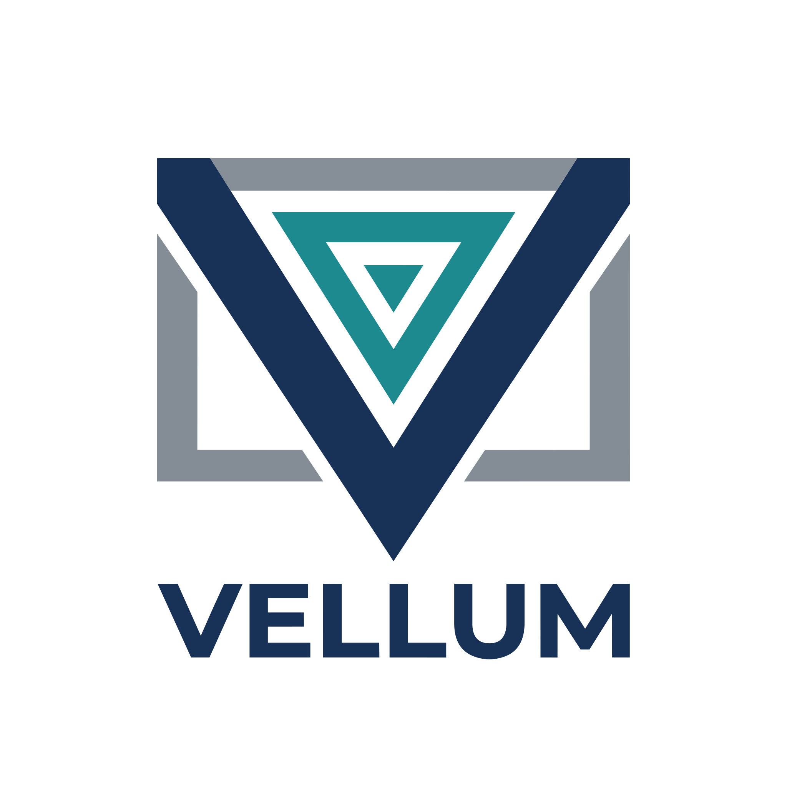

<p align="center">
  
</p>

# Vellum

[](https://github.com/lexict/vellum/actions/workflows/ci.yml)
[](LICENSE)

E-Ink display management platform. Centrally manage, brand, and deploy content to E-Paper displays powered by ESP32-S3.

## Features

- **Plugin Content System** — Room booking (Outlook day view), extensible for weather, dashboards, photos
- **Calendar Providers** — Microsoft 365, Google Calendar, iCal URL
- **Display Agnostic** — Supports mono, grayscale, and 7-color Spectra 6 displays
- **Pixel-Perfect Rendering** — Bitmap font atlas for color e-paper, anti-aliased for grayscale
- **Theme System** — DB-backed, per-device branding with live preview
- **Refresh Profiles** — Schedule rules by weekday/time (night mode, weekends, office hours)
- **OTA Updates** — Signed firmware distribution via GitHub Releases (Ed25519 + SHA256)
- **Zero-Config Setup** — mDNS auto-discovery, captive portal with Vellum branding
- **Encrypted Security** — X25519 ECDH token delivery, AES-256-GCM credentials at rest
- **Admin Dashboard** — Dark theme, responsive, toast notifications, search/filter/sort
- **Device Simulator** — Web-based E-Paper simulator for development
- **Web Flasher** — Flash firmware via USB from the browser

## Architecture

```
┌──────────────┐     HTTPS      ┌──────────────┐     APIs         ┌─────────────┐
│  ESP32-S3    │ ──────────────▶│  Next.js API  │ ──────────────▶ │  M365       │
│  E-Ink Panel │ ◀──────────────│  + Admin UI   │ ◀────────────── │  Google     │
└──────────────┘  pixel buffer  └──────┬───────┘                  │  iCal       │
                                       │                          └─────────────┘
                                       ▼
                                ┌──────────────┐
                                │  PostgreSQL   │
                                └──────────────┘
```

## Supported Hardware

| Model | Display | Resolution | Colors |
|-------|---------|-----------|--------|
| reTerminal E1001 | 7.5" | 800×480 | 4-level grayscale |
| reTerminal E1002 | 7.3" Spectra 6 | 800×480 | 7 colors |
| reTerminal E1003 | 10.3" | 1404×1872 | 16-level grayscale |

## Quick Start

```bash
cp .env.example .env    # Configure credentials
npm install
psql $DATABASE_URL < drizzle/0000_initial_schema.sql  # Run all migrations
npm run dev:mdns        # Start with mDNS discovery
```

Open http://localhost:3000/admin (default: admin / change-me)

## Project Structure

```
src/
├── app/
│   ├── admin/          # Dashboard (devices, content, providers, themes, profiles, firmware, telemetry)
│   ├── api/v1/         # Device API (hello, render, config, report, health)
│   ├── login/          # Admin authentication
│   └── simulator/      # Device simulator (dev only)
├── components/         # Shared UI (toast, modal, confirm, button, search, page-header)
├── db/                 # Drizzle schema + pool
└── lib/
    ├── auth/           # TOFU + X25519 ECDH
    ├── calendar/       # Provider registry (M365, Google, iCal)
    ├── content/        # Renderer registry (room-booking)
    ├── render/         # Canvas → pixel buffer (bitmap font, dithering, quantization)
    ├── sleep/          # Refresh profiles + schedule rules
    ├── firmware.ts     # OTA manifest fetcher + version resolver
    ├── display.ts      # Display capability negotiation
    ├── theme.ts        # Theme system (Zod-validated)
    ├── encryption.ts   # AES-256-GCM for credentials
    ├── crypto.ts       # X25519 ECDH for token delivery
    └── ...

firmware/
├── main/               # ESP-IDF entry point + OTA + ECDH
└── components/
    ├── vellum_display/  # Driver abstraction + E1001/E1002/E1003 drivers
    ├── http_client/     # Server communication
    ├── wifi_manager/    # Station + SoftAP captive portal
    ├── nvs_manager/     # Encrypted NVS storage
    ├── buttons/         # GPIO interrupt handler
    ├── sleep_manager/   # Deep sleep management
    └── qrcodegen/       # QR code generation (ESP Component Registry)
```

## License

MIT
