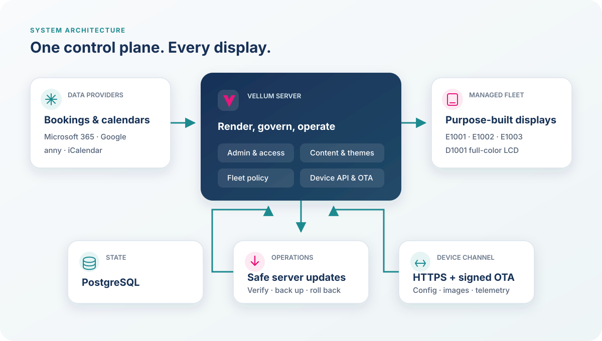

<p align="center">
  <picture>
    <source media="(prefers-color-scheme: dark)" srcset="public/brand/vellum-logo-on-dark.svg">
    
  </picture>
</p>

<p align="center">
  <strong>Open-source control plane for secure, centrally managed room displays.</strong><br>
  Render once. Operate every E-Paper and full-color display from one place.
</p>

<p align="center">
  <a href="https://github.com/metaneutrons/Vellum/actions/workflows/ci.yml"></a>
  <a href="https://github.com/metaneutrons/Vellum/releases/latest"></a>
  <a href="https://github.com/metaneutrons/Vellum/pkgs/container/vellum"></a>
  <a href="LICENSE"></a>
</p>

Vellum turns Seeed Studio reTerminal displays into a managed signage fleet. The
server combines booking data, content, branding, refresh policy, telemetry, and
firmware lifecycle management. Devices receive display-ready images and signed
updates over HTTPS; no browser engine or provider credential lives on a display.

<p align="center">
  
</p>

## Why Vellum

|                                  | Capability                                                                                                                                                        |
| -------------------------------- | ----------------------------------------------------------------------------------------------------------------------------------------------------------------- |
| **One fleet**                    | Provision, approve, assign, monitor, and update every supported display from the Web UI.                                                                          |
| **Provider-independent content** | Use Microsoft 365, Google Calendar, anny, or iCalendar without coupling display firmware to a booking system.                                                     |
| **Pixel-perfect output**         | Server-side rendering, model-aware color conversion, orientation support, themes, and live previews.                                                              |
| **Enterprise access**            | Local recovery accounts, Microsoft Entra ID OIDC, scoped roles, service accounts, and audit events.                                                               |
| **Secure device lifecycle**      | First-time USB enrollment, authorization-locked re-provisioning, HTTPS, and Ed25519-signed OTA firmware delivered through Vellum—displays need no Internet route. |
| **Safe operations**              | A production Compose stack with PostgreSQL, release discovery, scheduled or manual updates, backups, health checks, and rollback.                                 |

Approved displays can also be migrated to a new Vellum Server or moved to a new
Wi-Fi network from their device detail page. Commands arrive on the next
authenticated poll. Firmware validates the target or tests the new network
end-to-end while retaining the old profile; failed and interrupted Wi-Fi
changes roll back automatically. Wi-Fi passwords are encrypted at rest and are
never included in audit metadata or configuration history.

## Install for production — Docker Compose

The repository's Compose stack is the **recommended way to run Vellum**. It
installs the server, PostgreSQL, and the Vellum updater as one operational unit.
The updater discovers new server releases, verifies their signed container
images, creates a database backup, performs a readiness check, and rolls back a
failed update. In the Web UI, administrators can choose manual updates or a
daily maintenance time. After a healthy server update, a detached, health-checked
helper also upgrades the updater itself and rolls back a failed replacement.

### Requirements

- Docker Engine with Docker Compose v2, or Docker Desktop on macOS
- A writable directory for the stack and its persistent data

Before displays can use the server, additionally:

- An HTTPS reverse proxy with a publicly trusted certificate in front of
  `127.0.0.1:3000` — displays validate the certificate and reject cleartext
- A DNS name that resolves to that proxy from the display network

### Deploy

```bash
curl -fsSL https://github.com/metaneutrons/Vellum/releases/latest/download/install.sh | bash
```

That is the whole installation. It verifies the release assets against the release
`SHA256SUMS`, generates every secret, writes a `0600` `.env`, starts the stack,
waits for the server to report healthy, and prints the owner password once. Then
sign in at `http://127.0.0.1:3000/admin`.

Run from a terminal it offers two questions, both answerable with Enter — your
public HTTPS URL and your timezone. Everything else is generated or detected. Add
`--yes` to skip them, which is also what happens when no terminal is attached.

For a real deployment, name the directory and the public origin:

```bash
curl -fsSL https://github.com/metaneutrons/Vellum/releases/latest/download/install.sh \
  | bash -s -- --dir /srv/vellum --url https://vellum.example.com
```

`--version vX.Y.Z` installs a specific release, `--dry-run` prepares the directory
without starting anything, `--from <dir>` installs from assets already on an
air-gapped host, and `--help` lists the rest. The installer refuses to overwrite an
existing `.env`, so it can never replace the secrets of a running stack.

To check the script before running it, download `install.sh` and `SHA256SUMS` from
the same release and verify it:
`grep ' install.sh$' SHA256SUMS | sha256sum --check`.

**Prefer to wire it up yourself?** The stack is a single file —
[`deploy/docker-compose.yml`](deploy/docker-compose.yml), also attached to every
release with [`vellum.env.example`](deploy/vellum.env.example). Fill in the
template's placeholders, save it as `.env` with mode `0600`, and run
`docker compose up -d`. The
[production deployment guide](docs/DOCKER_DEPLOYMENT.md) covers the details.
Placeholders are enforced rather than advised: they are the same length as real
secrets, and both the server and the updater reject the shipped text outright
instead of booting on credentials that are public repository content.

Compose automatically reads `.env`. `DATABASE_URL` is derived from `POSTGRES_*`,
so the database password is defined in one place; set `DATABASE_URL` explicitly
only to use a database outside this stack. Relative bind mounts keep
configuration, PostgreSQL, backups, and updater state together in the directory
you selected:

The release-provided `.env` pins both the server and updater images to the same
exact `vX.Y.Z` release. Compose fails closed when either setting is missing; it
never silently falls back to a mutable `latest` image. New stacks enable safe
updater self-updates by default; an older updater needs one manual bootstrap,
which **System → Vellum Server** identifies with the exact commands.

| Path within the chosen directory | Contents                                      |
| -------------------------------- | --------------------------------------------- |
| `docker-compose.yml`             | Server, PostgreSQL, and updater stack         |
| `.env`                           | Secrets and deployment configuration (`0600`) |
| `data/postgres/`                 | PostgreSQL data                               |
| `data/backups/`                  | Consistent pre-update database backups        |
| `data/updater/`                  | Persistent updater configuration and state    |

No source checkout or fixed host path is required. You can choose another
directory, such as `/srv/vellum` or `/docker/vellum`; keep the files together
and run Compose from there. Stop the stack before copying the complete directory.
For a database-consistent backup while Vellum is running, use the dumps in
`data/backups/`, not a live copy of `data/postgres/`. To pin the initial
deployment, replace `releases/latest/download` with `releases/download/vX.Y.Z`.

### Upgrade an existing Compose installation

If **System → Vellum Server** says that the update service is unavailable, the
stack either predates the `updater` service, is missing its configuration, or
cannot currently reach it. This is a one-time host administration task. The Web
UI deliberately cannot install the service itself: only the dedicated updater
receives the root-equivalent Docker socket, never the Vellum server.

First change to the directory that contains the running stack and identify which
case applies:

```bash
cd /path/to/vellum
docker compose config --services
docker compose ps
```

If `updater` is listed, keep the existing Compose file and refresh the service:

```bash
docker compose pull updater
docker compose up -d --no-deps updater
docker compose ps updater
docker compose logs --tail=100 updater
```

If `updater` is **not** listed, do not run the installer over the existing
directory and do not blindly replace `.env`, `docker-compose.yml`, or the
PostgreSQL image and data mount. Back up the database and deployment files first:

```bash
mkdir -p data/backups
docker compose exec -T postgres sh -c \
  'pg_dump -U "$POSTGRES_USER" -d "$POSTGRES_DB" -Fc' \
  > "data/backups/vellum-before-updater-$(date -u +%Y%m%dT%H%M%SZ).dump"
cp -p docker-compose.yml "docker-compose.yml.before-updater"
cp -p .env ".env.before-updater"
```

Download and verify the current deployment templates in a temporary directory:

```bash
tmpdir="$(mktemp -d)"
release="https://github.com/metaneutrons/Vellum/releases/latest/download"
curl -fsSL -o "$tmpdir/docker-compose.yml" "$release/docker-compose.yml"
curl -fsSL -o "$tmpdir/vellum.env.example" "$release/vellum.env.example"
curl -fsSL -o "$tmpdir/SHA256SUMS" "$release/SHA256SUMS"
(cd "$tmpdir" && if command -v sha256sum >/dev/null; then
  grep -E ' (docker-compose.yml|vellum.env.example)$' SHA256SUMS | sha256sum --check
else
  grep -E ' (docker-compose.yml|vellum.env.example)$' SHA256SUMS | shasum -a 256 --check
fi)
```

Then merge the verified `updater` service and the server's `UPDATER_URL` setting
from the downloaded Compose file into the installed file. Preserve any local
reverse-proxy labels, networks, database image, and database volume layout. Add
the following missing settings to the existing `.env`; copy the exact
`UPDATER_IMAGE` value from the verified `vellum.env.example` and generate a new
token rather than copying its placeholder:

```dotenv
UPDATER_IMAGE=ghcr.io/metaneutrons/vellum-updater:vX.Y.Z
UPDATER_TOKEN=<output of openssl rand -hex 32>
AUTO_UPDATE_UPDATER=true
```

Validate the merged configuration before changing a running container. The
first command must succeed and `config --services` must now list `updater`:

```bash
docker compose config --quiet
docker compose config --services
docker compose pull updater
docker compose up -d --no-deps --force-recreate server updater
docker compose ps server updater
docker compose logs --tail=100 updater
rm -rf "$tmpdir"
```

Both services must report healthy. Reload **System → Vellum Server**; release
checks, manual or scheduled server updates, backups, rollback, and future updater
self-updates are now available. If the existing Compose file has local changes
or uses a different PostgreSQL major version or volume layout, review the merge
instead of replacing it wholesale; the
[production deployment guide](docs/DOCKER_DEPLOYMENT.md) documents the updater's
mounts, security boundary, and recovery procedures in detail.

The server listens on `127.0.0.1:3000`; terminate HTTPS at the reverse proxy.
Set `VELLUM_PUBLIC_URL` to the canonical HTTPS origin, then open
`https://your-vellum-host/admin`. Checksummed database migrations run
automatically and must complete successfully before the server accepts traffic.

> The installer generates `ADMIN_PASS` and prints it once.
> `ADMIN_USER` and `ADMIN_PASS` bootstrap the first local Owner account only
> when the user database is empty. Keep that local account as a protected
> break-glass path. `ADMIN_API_KEY` remains a legacy global API credential for
> compatibility; integrations should use revocable, scoped service accounts
> created in **Access** instead. All three variables are currently required at
> startup and must contain unique, randomly generated values.

Read the [production deployment guide](docs/DOCKER_DEPLOYMENT.md) before going
live. It covers reverse-proxy headers, image verification, updater controls,
backup restore, rollback, and operational hardening.

## First run

1. Sign in with the bootstrap Owner account.
2. Add a booking source under **Providers**.
3. Create content, choose a theme, and optionally define a refresh profile.
4. Open **Firmware → Flash device** and install the firmware for the exact model.
5. Continue to **Provision** and send Wi-Fi, time, and server settings over USB.
6. Approve the device or use a single-use enrollment voucher, then assign its content.
7. Configure server updates under **System → Vellum Server**.

Displays communicate only with their configured Vellum HTTPS origin. For OTA,
the server discovers signed firmware on GitHub and issues a short-lived download
URL bound to that device, model, and release. Vellum then delivers the binary;
the display never needs direct Internet or GitHub access and still verifies the
model, SHA-256 digest, and Ed25519 signature before booting it. The Vellum server
itself needs outbound HTTPS access to GitHub Releases when an update is fetched.
Immutable OTA binaries are retained in a bounded 128 MiB in-memory LRU cache for
24 hours, and concurrent requests for the same model/release share one upstream
download. The cache is deliberately disposable and is cleared by a server restart.

Chrome or Edge is required for browser-based flashing and USB provisioning
because these flows use Web Serial. E-Series devices expose USB through a UART
bridge; D1001 uses its native USB interface. Opening the port restarts the
display once; Vellum then keeps one USB session open for network scans and the
final provisioning step. If USB is unavailable, any
unprovisioned device — every model, D1001 included — also offers the
`Vellum-XXXX` SoftAP fallback.

## Supported displays

Firmware is built and released separately for each model. The server negotiates
capabilities reported by the device, so E-Paper and LCD displays share the same
fleet, content, and policy model without sharing an incompatible firmware image.

| Model                                                                                                                                                      | Platform            | Display                           | Server output       | Orientation           |
| ---------------------------------------------------------------------------------------------------------------------------------------------------------- | ------------------- | --------------------------------- | ------------------- | --------------------- |
| [reTerminal E1001](https://www.seeedstudio.com/reTerminal-E1001-p-6534.html) ([docs](https://wiki.seeedstudio.com/getting_started_with_reterminal_e1001/)) | ESP32-S3            | 7.5″, 800×480, monochrome E-Paper | Raw 1-bit           | Landscape             |
| [reTerminal E1002](https://www.seeedstudio.com/reTerminal-E1002-p-6533.html) ([docs](https://wiki.seeedstudio.com/getting_started_with_reterminal_e1002/)) | ESP32-S3            | 7.3″, 800×480, six-color E-Paper  | Raw indexed color   | Landscape             |
| [reTerminal E1003](https://www.seeedstudio.com/reTerminal-E1003-p-6731.html) ([docs](https://wiki.seeedstudio.com/getting_started_with_reterminal_e1003/)) | ESP32-S3            | 10.3″, 1872×1404, 16-gray E-Paper | Raw 4-bit grayscale | Portrait or landscape |
| [reTerminal D1001](https://wiki.seeedstudio.com/getting_started_with_reterminal_d1001/)                                                                    | ESP32-P4 + ESP32-C6 | 8″, 800×1280, full-color LCD      | JPEG                | Portrait or landscape |

Support includes board-specific display drivers, battery and USB-power handling,
buttons, telemetry, provisioning, and OTA behavior. D1001 additionally integrates
its RTC and uses the ESP32-C6 as the wireless coprocessor for the ESP32-P4. Its
factory image targets the board's 32 MiB QSPI flash and 32 MiB PSRAM, with two
8 MiB OTA slots. A D1001 flashed with an older Vellum partition table continues
to receive compatible app-only OTA updates, but requires one USB factory flash
to adopt the larger OTA slots and storage partition.

## Product capabilities

### Content and booking

- Room booking, door-sign, and multi-door-sign content renderers
- Microsoft 365, Google Calendar, anny, and iCalendar providers
- Provider or custom booking URLs rendered as optional QR codes
- Themes, live previews, time zones, and per-device assignments
- Weekday/time rules for refresh cadence and overnight behavior

### Fleet and firmware

- Browser-based firmware flashing with model and release selection
- USB/Web-Serial provisioning, Wi-Fi scan, manual network entry, NTP override,
  and device clock initialization
- Voucher-backed zero-touch enrollment and version pinning across the
  flash-to-provision flow
- Capability, orientation, battery, RSSI, associated Wi-Fi network, negotiated
  Wi-Fi security, firmware, and rollout telemetry. Wi-Fi passwords are never
  included in telemetry.
- Signed OTA releases with staged verification, retry grace periods, and
  model-specific firmware channels
- Development-only device simulator for all four supported models

### Identity and access

- Local accounts with scrypt-hashed passwords
- Microsoft Entra ID OIDC with verified-claim account linking and optional
  role-controlled auto-provisioning
- Owner, Administrator, Fleet Operator, Content Manager, Firmware Operator,
  Auditor, and Viewer roles
- Scoped, revocable service-account tokens and audit history

For Entra ID, configure the canonical origin only:

```dotenv
VELLUM_PUBLIC_URL=https://vellum.example.com
ENTRA_TENANT_ID=00000000-0000-0000-0000-000000000000
ENTRA_CLIENT_ID=00000000-0000-0000-0000-000000000000
ENTRA_CLIENT_SECRET=store-this-in-your-secret-manager
```

Register this exact Web redirect URI in the Entra application:

```text
https://vellum.example.com/api/auth/oidc/entra/callback
```

The callback path is fixed and derived from `VELLUM_PUBLIC_URL`. The URL must be
an HTTPS origin without a path, query, or fragment.

## Security model

- Devices validate the server certificate and refuse cleartext production URLs
  and HTTPS-to-HTTP redirects.
- Enrollment uses X25519 ECDH to deliver the device token over an encrypted
  channel; stored server-side credentials use AES-256-GCM.
- OTA firmware is verified with Ed25519 and SHA-256 before the staged partition
  becomes bootable.
- The reversible `testsecure` profile locally test-signs firmware, reports its
  posture to Vellum, and HMAC-seals sensitive NVS state without burning eFuses.
  It detects corruption in the trusted firmware path, but cannot resist
  malicious replacement firmware or provide confidentiality against physical
  flash access.
  Encrypted NVS and Secure Boot v2 remain feature-locked irreversible profiles
  (ESP32-S3 only) and are not part of normal released images. See
  [Secure Boot and KMS](docs/SECURE_BOOT_AND_KMS.md).
- Devices report the partition table actually parsed from flash (canonical
  layout plus SHA-256 fingerprint), chip/flash identity, and live Secure Boot /
  Flash Encryption eFuse state. Vellum cross-checks this evidence with the model
  and build profile and blocks incompatible OTA images even when a version is
  pinned. Legacy firmware can only bootstrap to a reversible development image;
  secure layout transitions always require an authenticated factory flash.
- Admin sessions use HTTP-only cookies, local passwords are scrypt-hashed, and
  authorization is enforced through scoped permissions.
- Server container releases are keylessly signed and verified by the Compose
  updater before installation.

The threat model, production controls, and platform-specific limitations are in
[SECURITY.md](SECURITY.md). Firmware signing, secure-boot preparation, and KMS
integration are documented in [Secure Boot and KMS](docs/SECURE_BOOT_AND_KMS.md).

## Develop Vellum

### Prerequisites

- Node.js 22.13 or newer
- pnpm 11.20.0 (pinned through `packageManager`)
- PostgreSQL 15 or newer

```bash
git clone https://github.com/metaneutrons/Vellum.git
cd Vellum
# Node 25 and newer no longer bundle Corepack; install the pinned pnpm directly.
npm install --global pnpm@11.20.0
pnpm install --frozen-lockfile
cp .env.example .env

# Configure .env, then create the database and run migrations.
createdb vellum
pnpm db:migrate
pnpm dev:mdns
```

Open <http://localhost:3000/admin>. The direct `docker run` route is intentionally
not presented as a production installation: it does not provide the managed
PostgreSQL and safe-update workflow of the Compose stack.

### Quality gates

```bash
pnpm lint          # ESLint with zero-warning policy + brand consistency
pnpm format:check  # Prettier verification without modifying files
pnpm format        # Apply the canonical format locally
pnpm typecheck     # TypeScript, no emit
pnpm test          # Vitest
pnpm i18n:check    # Locale parity and hard-string checks
pnpm release:check # Release and workflow invariants
pnpm build         # Production Next.js build
```

`pnpm install` configures repository-owned Git hooks. Pre-commit runs Prettier
and ESLint with a zero-warning policy on staged files and stages their safe
fixes. Pre-push runs the i18n, type, release, and database guards. CI repeats
these guarantees repository-wide, including an independent formatting check,
coverage enforcement, the production build, Compose validation, and updater
tests. Generated firmware, vendored browser bundles, release notes, and the
generated font atlas remain governed by their respective generators.

### Build firmware

ESP-IDF 6.0 is installed separately. The firmware Makefile activates the local
ESP-IDF environment configured for the workstation.

```bash
cd firmware
make build MODEL=e1001
make build MODEL=e1002
make build MODEL=e1003
make build MODEL=d1001

# Flash the selected model and open its serial monitor.
make fm MODEL=d1001
```

Configuration options live in `firmware/main/Kconfig.projbuild`; the display
subsystem is described in [Firmware display architecture](docs/firmware-display-architecture.md).

## Repository map

| Path               | Purpose                                                          |
| ------------------ | ---------------------------------------------------------------- |
| `src/app/admin`    | Fleet, content, provider, theme, access, firmware, and update UI |
| `src/app/api/v1`   | Device, admin, health, enrollment, and updater APIs              |
| `src/lib/calendar` | Provider registry and calendar integrations                      |
| `src/lib/content`  | Content renderer registry                                        |
| `src/lib/render`   | Canvas, quantization, dithering, fonts, and display output       |
| `src/lib/access`   | Local identity, OIDC, roles, and service accounts                |
| `firmware`         | ESP-IDF application and board/display components                 |
| `deploy`           | Production Compose stack, updater, and environment template      |
| `docs`             | Deployment, security, release, and firmware design guides        |

## API surface

Displays use the versioned `/api/v1/ink/*` endpoints for enrollment, config,
rendering, telemetry, and issue reports. Automation should use a scoped service
account against `/api/v1/admin/*`; the browser UI uses its authenticated session.
`GET /api/v1/health` provides the Compose and reverse-proxy health check.

## Contributing

Contributions are welcome. Open an issue before a substantial change, keep each
pull request focused, and run the quality gates above. The release process is
documented in [docs/RELEASING.md](docs/RELEASING.md); planned work lives in
[ROADMAP.md](ROADMAP.md).

## Acknowledgments

- [Seeed Studio](https://www.seeedstudio.com/) — reTerminal E-Series and D-Series hardware
- [Espressif](https://www.espressif.com/) — ESP-IDF, ESP32-S3, ESP32-P4, and ESP32-C6
- [Next.js](https://nextjs.org/) — server and administration interface
- [Project Nayuki](https://www.nayuki.io/page/qr-code-generator-library) — QR code generation
- [Inter](https://rsms.me/inter/) — display typeface
- [Pixabay](https://pixabay.com/sound-effects/correct-choice-43861/) — the D1001
  confirmation chime ("Correct Choice", `freesound_community`), trimmed and
  embedded as PCM by `assets/render-audio.sh`

## License

Vellum is licensed under the [GNU Affero General Public License v3.0](LICENSE).
