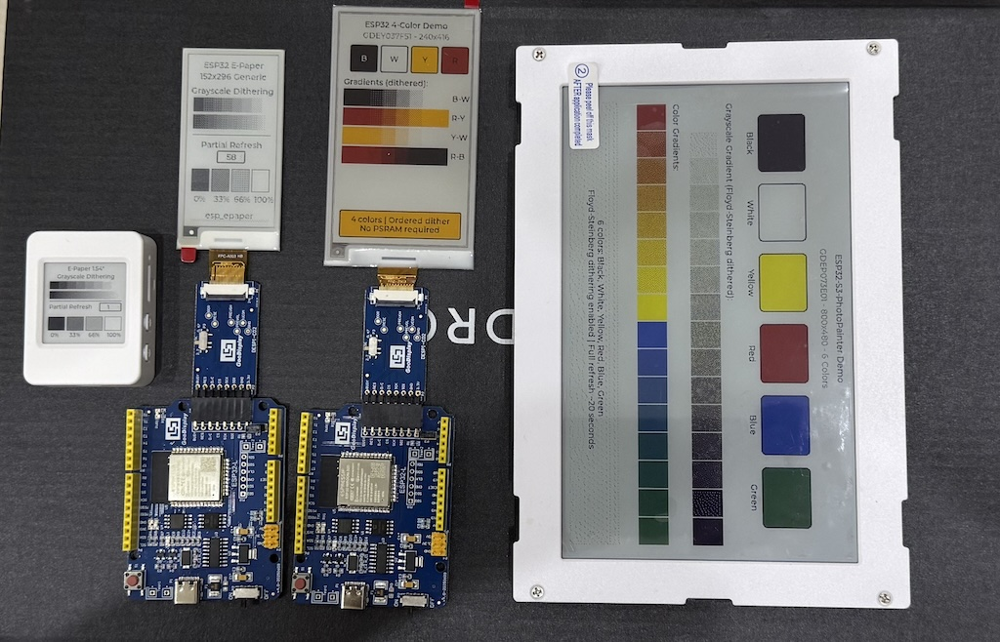
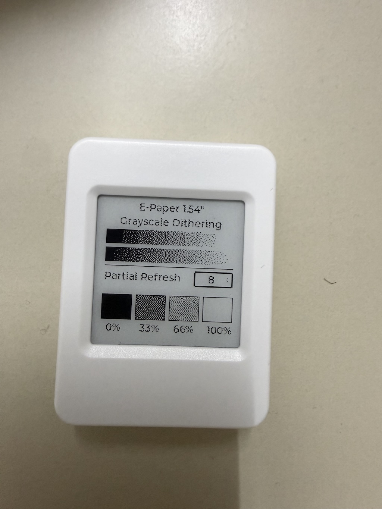
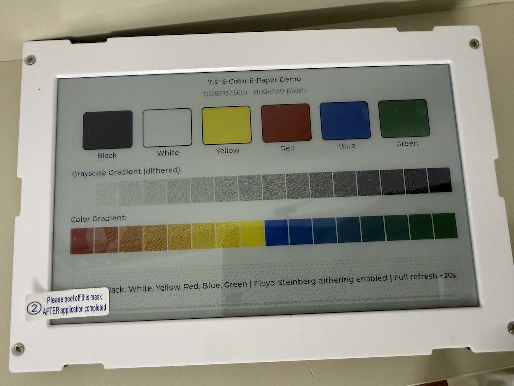

# ESP E-Paper Component

[](https://components.espressif.com/components/tuanpmt/esp_epaper)

A flexible e-paper display driver component for ESP-IDF with LVGL 9 integration. Designed for IoT devices, electronic shelf labels, photo frames, and low-power display applications.

## Supported Boards

<table>
  <tr>
    <td colspan="2" align="center">
      
    </td>
  </tr>
  <tr>
    <td width="50%">
      
      <br/>
      <b>ESP32-S3-ePaper-1.54</b><br/>
      200x200 Black/White with partial refresh<br/>
      <a href="https://www.waveshare.com/wiki/ESP32-S3-ePaper-1.54">Waveshare Wiki</a>
    </td>
    <td width="50%">
      
      <br/>
      <b>ESP32-S3-PhotoPainter</b><br/>
      800x480 6-Color with Floyd-Steinberg dithering<br/>
      <a href="https://www.waveshare.com/wiki/ESP32-S3-PhotoPainter">Waveshare Wiki</a>
    </td>
  </tr>
</table>

## Key Features

### Multi-Color Panel Support
- **Black/White (1-bit)**: Classic e-paper with fastest refresh
- **4-Color BWRY (2-bit)**: Black, White, Red, Yellow
- **6-Color (4-bit)**: Black, White, Yellow, Red, Blue, Green - ideal for photo frames

### Floyd-Steinberg Dithering
Advanced error-diffusion dithering algorithm for photo-quality images:
- Smooth gradients using only available colors
- Automatic RGB565 to panel palette conversion
- PSRAM support for large displays (800x480)

### LVGL 9 Partial Refresh
Smart partial refresh for BW panels:
- Base image tracking for differential updates
- Automatic mode switching (partial <-> full)
- Configurable ghosting prevention

### Data-Driven Architecture
- **Panel Registry**: Add new panels with a single line of code
- **Controller Abstraction**: Reusable controller implementations
- **Capability Flags**: Runtime feature detection (partial, fast, grayscale)

### Memory Efficient
- Automatic PSRAM allocation for large buffers
- Chunked SPI transfers for DMA compatibility
- Optional dithering buffer

## Supported Panels

### Specific Panels (Custom LUT/Features)

| Panel | Size | Resolution | Colors | Partial Refresh |
|-------|------|------------|--------|-----------------|
| GDEY0154D67 | 1.54" | 200x200 | BW | Yes (custom LUT) |
| GDEP073E01 | 7.3" | 800x480 | 6-Color | No |
| GDEY037F51 | 3.7" | 240x416 | 4-Color BWRY | No |

### Generic SSD16xx Panels

Adding new BW panels requires only **1 line of code** - see [ADDING_PANELS.md](ADDING_PANELS.md).

| Panel Type | Size | Resolution | Compatible Models |
|------------|------|------------|-------------------|
| SSD16XX_154 | 1.54" | 200x200 | GDEM0154I61, etc. |
| SSD16XX_213 | 2.13" | 122x250 | GDEY0213B74, GDEM0213I61 |
| SSD16XX_266 | 2.66" | 152x296 | GDEY0266T90, GDEY0266T90H |
| SSD16XX_270 | 2.7" | 176x264 | GDEY027T91, GDEM027Q72 |
| SSD16XX_290 | 2.9" | 128x296 | GDEY029T94, GDEY029T71H |
| SSD16XX_370 | 3.7" | 280x480 | GDEY037T03 |
| SSD16XX_420 | 4.2" | 400x300 | GDEY042T81, GDEQ0426T82 |

## Installation

### Using ESP-IDF Component Registry (Recommended)

Add to your project's `idf_component.yml`:

```yaml
dependencies:
  tuanpmt/esp_epaper: "^1.0.4"
  lvgl/lvgl: "^9.4.0"
```

Then run:
```bash
idf.py reconfigure
```

### Manual Installation

Clone or copy this repository to your project's `components` folder:

```bash
cd your_project/components
git clone https://github.com/tuanpmt/esp_epaper.git
```

## Quick Start

### Basic Usage

```c
#include "epaper.h"
#include "epaper_lvgl.h"
#include "lvgl.h"

void app_main(void)
{
    lv_init();

    // Use preset configuration for ESP32-S3-ePaper-1.54
    epd_config_t cfg = EPD_CONFIG_ESP32S3_154();

    // Initialize e-paper
    epd_handle_t epd;
    ESP_ERROR_CHECK(epd_init(&cfg, &epd));

    // Initialize LVGL display
    epd_lvgl_config_t lvgl_cfg = EPD_LVGL_CONFIG_DEFAULT();
    lvgl_cfg.epd = epd;
    lv_display_t *disp = epd_lvgl_init(&lvgl_cfg);

    // Create UI with LVGL...
    lv_obj_t *label = lv_label_create(lv_screen_active());
    lv_label_set_text(label, "Hello E-Paper!");
    lv_obj_center(label);

    // Refresh display
    epd_lvgl_refresh(disp);
}
```

### 6-Color Panel with Dithering (PhotoPainter)

```c
epd_config_t cfg = EPD_CONFIG_73_6COLOR();
epd_handle_t epd;
epd_init(&cfg, &epd);

epd_lvgl_config_t lvgl_cfg = EPD_LVGL_CONFIG_DEFAULT();
lvgl_cfg.epd = epd;
lvgl_cfg.update_mode = EPD_UPDATE_FULL;
lvgl_cfg.dither_mode = EPD_DITHER_FLOYD_STEINBERG;

lv_display_t *disp = epd_lvgl_init(&lvgl_cfg);
```

### 4-Color BWRY Panel

```c
epd_config_t cfg = EPD_CONFIG_ESP32_WROOM_4COLOR();
epd_handle_t epd;
epd_init(&cfg, &epd);

epd_lvgl_config_t lvgl_cfg = EPD_LVGL_CONFIG_DEFAULT();
lvgl_cfg.epd = epd;
lvgl_cfg.dither_mode = EPD_DITHER_ORDERED;  // Good for BWRY

lv_display_t *disp = epd_lvgl_init(&lvgl_cfg);
```

## Configuration Presets

```c
// Waveshare ESP32-S3-ePaper-1.54 (1.54" BW)
epd_config_t cfg = EPD_CONFIG_ESP32S3_154();

// Waveshare ESP32-S3-PhotoPainter (7.3" 6-Color)
epd_config_t cfg = EPD_CONFIG_73_6COLOR();

// Good Display ESP32-WROOM-32D (2.66" BW)
epd_config_t cfg = EPD_CONFIG_ESP32_WROOM();

// Good Display ESP32-WROOM-32D + 3.7" 4-Color BWRY
epd_config_t cfg = EPD_CONFIG_ESP32_WROOM_4COLOR();
```

### Custom Configuration

```c
epd_config_t cfg = {
    .pins = {
        .busy = GPIO_NUM_8,
        .rst = GPIO_NUM_9,
        .dc = GPIO_NUM_10,
        .cs = GPIO_NUM_11,
        .sck = GPIO_NUM_12,
        .mosi = GPIO_NUM_13,
    },
    .spi = {
        .host = SPI2_HOST,
        .speed_hz = 10000000,  // 10MHz
    },
    .panel = {
        .type = EPD_PANEL_GDEY0154D67,
        .width = 0,   // 0 = use panel default
        .height = 0,
    },
};
```

## Update Modes

| Mode | Description | Use Case |
|------|-------------|----------|
| `EPD_UPDATE_FULL` | Full refresh with flashing | Initial display, clearing ghosting |
| `EPD_UPDATE_PARTIAL` | Fast partial update | UI updates, counters |
| `EPD_UPDATE_FAST` | Fast mode (panel dependent) | Animations |

## Architecture Overview

```
+------------------+     +-------------------+     +------------------+
|   Application    |---->|   epaper_lvgl.c   |---->|    epaper.c      |
|   (LVGL UI)      |     | (RGB565->EPD fmt) |     | (Device Manager) |
+------------------+     +-------------------+     +------------------+
                                                          |
                         +--------------------------------+
                         |
                         v
+------------------+     +-------------------+
| epaper_registry.c|---->|   controllers/    |
| (Panel Database) |     | - ssd16xx.c       |
|                  |     | - gdey0154_lut.c  |
| - Panel specs    |     | - acep_6color.c   |
| - Capabilities   |     | - bwry_4color.c   |
| - Controller map |     +-------------------+
+------------------+
```

### Panel Registry (Data-Driven)

All panels are defined in a single registry table:

```c
static const epd_panel_desc_t panel_registry[EPD_PANEL_COUNT] = {
    [EPD_PANEL_GDEY0154D67] = {
        .name = "GDEY0154D67",
        .width = 200, .height = 200,
        .color_mode = EPD_COLOR_BW,
        .bits_per_pixel = 1,
        .caps = EPD_CAP_PARTIAL | EPD_CAP_FAST,
        .ctrl = EPD_CTRL_GDEY0154_LUT,
    },
    // ... more panels
};
```

### Capability Flags

```c
#define EPD_CAP_PARTIAL     (1 << 0)  // Supports partial refresh
#define EPD_CAP_FAST        (1 << 1)  // Supports fast refresh
#define EPD_CAP_GRAYSCALE   (1 << 2)  // Supports grayscale mode
#define EPD_CAP_BUSY_INV    (1 << 3)  // Inverted busy signal
```

## Floyd-Steinberg Dithering

The component implements Floyd-Steinberg error-diffusion dithering for photo-quality images on limited color e-paper displays.

### How It Works

1. **RGB565 -> RGB888 Conversion**: LVGL buffer is converted with proper bit expansion
2. **Palette Matching**: Each pixel is matched to the nearest e-paper color
3. **Error Diffusion**: Quantization error is distributed to neighbors (7/16 right, 3/16 bottom-left, 5/16 bottom, 1/16 bottom-right)

### Dithering Modes

| Mode | Description | Memory | Quality |
|------|-------------|--------|---------|
| `EPD_DITHER_NONE` | Direct color mapping | None | Basic |
| `EPD_DITHER_ORDERED` | Bayer 4x4 pattern | None | Good |
| `EPD_DITHER_FLOYD_STEINBERG` | Error diffusion | W*H*3 | Best |

### Color Palette

| Color | RGB Value | E-Paper Code |
|-------|-----------|--------------|
| Black | (0, 0, 0) | 0x00 |
| White | (255, 255, 255) | 0x01 |
| Yellow | (255, 255, 0) | 0x02 |
| Red | (255, 0, 0) | 0x03 |
| Blue | (0, 0, 255) | 0x05 |
| Green | (0, 255, 0) | 0x06 |

## Partial Refresh

BW panels support partial refresh for fast updates without full-screen flashing.

### How It Works

1. **Base Image**: First update writes to both current RAM (0x24) and base RAM (0x26)
2. **Partial Updates**: Subsequent updates only write to current RAM (0x24)
3. **Differential Update**: Display compares RAMs and only refreshes changed pixels

### Usage

```c
epd_lvgl_config_t lvgl_cfg = EPD_LVGL_CONFIG_DEFAULT();
lvgl_cfg.epd = epd;
lvgl_cfg.update_mode = EPD_UPDATE_PARTIAL;
lvgl_cfg.use_partial_refresh = true;

lv_display_t *disp = epd_lvgl_init(&lvgl_cfg);

// First refresh sets base image (full refresh)
epd_lvgl_refresh(disp);

// Subsequent refreshes use partial mode
lv_label_set_text(label, "Count: 1");
epd_lvgl_refresh(disp);  // Fast partial update

// Force full refresh periodically to clear ghosting
epd_lvgl_force_full_refresh(disp);
epd_lvgl_refresh(disp);
```

**Note**: Multi-color panels (6-color, 4-color BWRY) do not support partial refresh.

## Examples

See the `examples/` folder for complete examples:

| Example | Board | Description |
|---------|-------|-------------|
| [esp32s3_epaper_154](examples/esp32s3_epaper_154) | ESP32-S3-ePaper-1.54 | 1.54" BW with grayscale dithering |
| [esp32s3_photopainter](examples/esp32s3_photopainter) | ESP32-S3-PhotoPainter | 7.3" 6-Color with dithering |
| [esp32_wroom_generic](examples/esp32_wroom_generic) | ESP32-WROOM-32D | Generic SSD16xx, responsive UI |
| [esp32_wroom_4color](examples/esp32_wroom_4color) | ESP32-WROOM-32D | 3.7" 4-Color BWRY |

### Building Examples

```bash
cd examples/esp32s3_epaper_154
idf.py set-target esp32s3
idf.py build
idf.py -p PORT flash monitor
```

## API Reference

### Core Functions

```c
esp_err_t epd_init(const epd_config_t *config, epd_handle_t *handle);
esp_err_t epd_deinit(epd_handle_t handle);
esp_err_t epd_get_info(epd_handle_t handle, epd_panel_info_t *info);
uint8_t* epd_get_framebuffer(epd_handle_t handle);
esp_err_t epd_update(epd_handle_t handle, const uint8_t *data, epd_update_mode_t mode);
esp_err_t epd_fill(epd_handle_t handle, uint8_t color);
esp_err_t epd_sleep(epd_handle_t handle);
esp_err_t epd_wake(epd_handle_t handle);
```

### LVGL Functions

```c
lv_display_t* epd_lvgl_init(const epd_lvgl_config_t *config);
void epd_lvgl_deinit(lv_display_t *disp);
void epd_lvgl_refresh(lv_display_t *disp);
void epd_lvgl_force_full_refresh(lv_display_t *disp);
void epd_lvgl_set_update_mode(lv_display_t *disp, epd_update_mode_t mode);
void epd_lvgl_set_dither_mode(lv_display_t *disp, epd_dither_mode_t mode);
```

## Adding New Panels

See [ADDING_PANELS.md](ADDING_PANELS.md) for detailed instructions on adding support for new e-paper panels.

**Quick summary**:
- **Same controller, different size**: Add 1 line to panel registry
- **New controller**: Add controller ops + panel registry entry

## Memory Requirements

| Panel | Resolution | BPP | Framebuffer | RGB Buffer (dithering) |
|-------|------------|-----|-------------|------------------------|
| 1.54" BW | 200x200 | 1 | 5 KB | 120 KB |
| 2.13" BW | 122x250 | 1 | 3.8 KB | 92 KB |
| 2.66" BW | 152x296 | 1 | 5.6 KB | 135 KB |
| 3.7" BW | 280x480 | 1 | 16.8 KB | 403 KB |
| 4.2" BW | 400x300 | 1 | 15 KB | 360 KB |
| 3.7" BWRY | 240x416 | 2 | 25 KB | 300 KB |
| 7.3" 6-Color | 800x480 | 4 | 192 KB | 1.15 MB |

**Note**: Large buffers (>32KB) are automatically allocated from PSRAM when available.

## License

MIT License - See [LICENSE](LICENSE)

## Author

- **tuanpmt** - [GitHub](https://github.com/tuanpmt)
